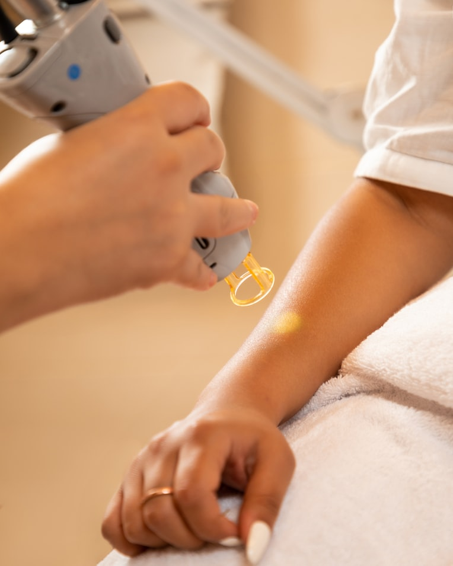

# Skin Lesion Classifier (Benign vs Malignant)

GET 324 - Laboratory Exercise 10 (Mini-Project)
Group: CE5

## App Preview

*Photo by [Photographer Name](https://unsplash.com/@username) on [Unsplash](https://unsplash.com/photos/a-woman-getting-her-nails-done-at-a-nail-salon-quaIM4h-u5E)*

## ⚠️ Important Disclaimer

This application was built by students as an academic mini-project. While the deployed model achieves a high accuracy on its test set, **this tool is not a diagnostic device and should never be used as proof that a lesion is or is not cancerous.**

- It has not been clinically validated.
- It has only been trained and tested on a limited, public dataset.
- A high accuracy score does not guarantee correctness on any individual image, especially yours.

**If you are concerned about a skin lesion, please consult a licensed dermatologist or medical professional.** Do not delay seeking real medical advice based on this app's output.

## Overview
A binary image classifier that distinguishes benign from malignant
dermatoscopic skin lesion images, deployed as a Streamlit web application.

Two architectures were trained and compared:
1. A custom CNN (three convolutional blocks, trained from scratch)
2. MobileNetV3Small via transfer learning (frozen feature extraction, then fine-tuned)

The best-performing model (MobileNetV3, frozen) was selected for deployment,
prioritizing the lowest false-negative rate over raw accuracy.

## Dataset
[Skin Cancer: Malignant vs Benign](https://www.kaggle.com/datasets/fanconic/skin-cancer-malignant-vs-benign) (Kaggle)

## Project Structure
- `app.py` - Streamlit application
- `train_model.py` - Training and evaluation pipeline
- `requirements.txt` - Python dependencies
- `models/` - Saved trained models

## How to Run Locally
1. Clone this repo
2. `pip install -r requirements.txt`
3. `streamlit run app.py`

## Team Members

| Name | Registration Number | GitHub Username |
|------|---------------------|------------------|
| Ukpuho Miracle Aniekan | 22/EG/CE/1402 | Mabu04 |
| Eze Agatha Oluebube | 22/EG/CE/1352 | Nik-ki25 |
| Okon Clement Emem | 22/EG/CE/1392 | Okonclement10 |
| Ebong Augustine Jerome | 22/EG/CE/1382 | Ebongaustine10 |
| George Felix Uduak | 22/EG/CE/1422 | fg9190293 |
| Ekemini Udoma Ekong | 22/EG/CE/1412 | blackstar2004 |
| Akaka Nsisong Victoria | 22/EG/CE/1372 | Naddiee |
| Usoro Favour Elijah | 22/EG/CE/1362 | Usorofavour-43 |

## Future Improvements

- Expand the dataset to include more diverse skin tones, since dermatoscopic datasets are often skewed toward lighter skin and this affects real-world reliability
- Add Grad-CAM or similar visual explanations so predictions show *which region* of the lesion influenced the classification
- Move from binary (benign/malignant) to multi-class classification (e.g. melanoma, basal cell carcinoma, nevus) for more clinically useful output
- Add confidence calibration so the probability score reflects true model certainty, not just a raw softmax output
- Package the MobileNetV3 model for on-device/mobile inference to reduce dependence on a hosted app
- Add unit tests for the preprocessing and inference pipeline
- Collect user feedback within the app (e.g. "was this prediction correct?") to build a dataset for future retraining

## Acknowledgements

- Dataset: [Skin Cancer: Malignant vs Benign](https://www.kaggle.com/) via Kaggle
- MobileNetV3Small architecture and pretrained weights
- Built as a mini-project for GET 324 (Group CE5)
- Streamlit for the app framework

## License

MIT
